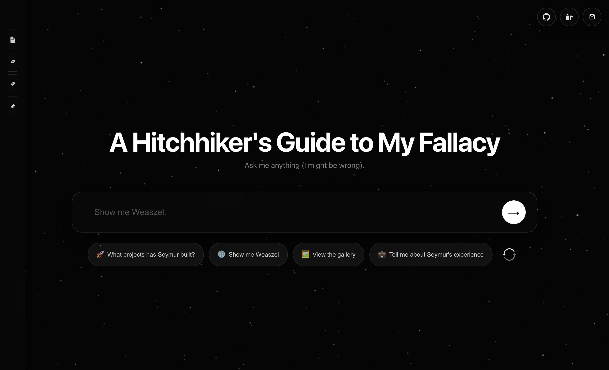

# Portfolio

This is **Seymur Mammadov’s portfolio** — a space-themed, chat-first experience that lets visitors explore his work, background, and demos.

## What you can do

- **Ask questions** about Seymur (background, experience, skills, hobbies, etc.)
- **Open artifacts** to view richer content:
  - **Gallery** (photos/visuals)
  - **Live website previews** (e.g. Weaszel, UI components/storybook)
  - **Contact** (write and send an email)
- **Browse writing** (Medium/LinkedIn posts) from the sidebar

## Example prompts

- “Tell me about Seymur’s experience.”
- “What’s his tech stack?”
- “Show me Weaszel.”
- “Did you build a UI library?”
- “View the gallery.”
- “How can I contact you?”
