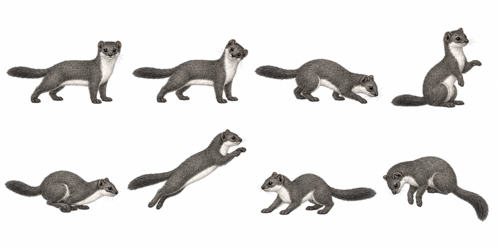
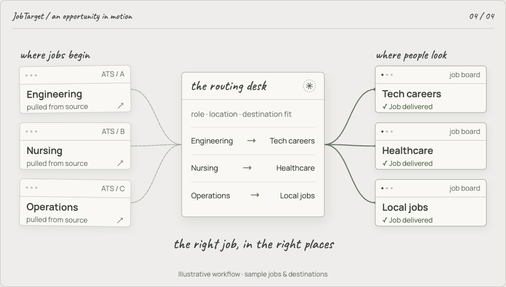

<div align="center">

# Seymur Mammadov
### A portfolio with a little personality.

Graphite artwork. Handwritten stories. A curious weasel. A ghost who goes fishing.

[Explore the portfolio](https://seymur-mammadov-portfolio.smammadov494.chatgpt.site) · [Weaszel Swagger reference](https://weaszel-youtube-swagger.smammadov494.chatgpt.site)

*The hosted sites currently require the owner's ChatGPT account.*

</div>


## Meet the cast

The opening screen is reserved for my name and the interactive hero; featured work begins below the first viewport.

**Astro** fishes up little pieces of my story. Catch a bite and a thought bubble opens beside him. Occasionally, mountains rise, a golden sun comes up above blue and sage-green mountains, and he looks up with closed eyes before monochrome TV static slowly reshapes his silhouette into a larger, full-body graphite illustration of me fishing on a rock, looking toward the sunlight in a consistent graphite style. The figure distorts and shrinks back into Astro before returning to fishing, keeping your collected facts. The “a little sunshine” control replays it; reduced-motion mode shows the still fishing illustration on request.

**Weaszel** leads the featured work with a 30-second, scroll-controlled Remotion film. He runs in, stops to look at you, investigates the page, taps a tool into shape, and jumps behind the card before settling on its corner. One character, with distinct actions throughout the story.



The film explains the website-to-MCP adapter prototype: observe a page and its controls, describe useful actions as tools, inspect the generated OpenAPI reference, and call the local adapter. The portfolio illustrates that workflow; it does not run the adapter in the hosted page.

## PumpAds — a product by 2xROAS, Inc.

I co-founded 2xROAS, Inc., the company behind PumpAds, with my partners to turn product ideas into creator-style video ads. The second featured story uses three monochrome creator cards to walk through the creative and production process.

<table>
  <tr>
    <td width="33%"></td>
    <td width="33%"></td>
    <td width="33%"></td>
  </tr>
  <tr><td align="center">Skincare</td><td align="center">Everyday essentials</td><td align="center">Audio</td></tr>
</table>

*AI-generated illustrative creator concepts, not actual customer campaigns.*

Our shared company results included:

- **1,000+ paying customers** and **$15K in monthly revenue** within two months of launch.
- Average generation time reduced from **10 minutes to 2 minutes**.
- Support for bursts of **100 concurrent requests** through independently scalable services and persistent job state.

The pipeline combined script generation, voice cloning, image and video generation, lip sync, revoicing, and FFmpeg assembly. The portfolio also covers the credit ledger, automatic refunds, and infrastructure work behind the product.

## SwipeBuilder — a home for good ideas

[SwipeBuilder](https://swipebuilder.io/) follows PumpAds as the third featured project. A scroll-driven animated paper storyboard follows the workflow from collecting ad references to organizing a board, reading the creative, and developing new copy.

<p align="center">
  
  
  
</p>

The 24-second Remotion film supports scroll scrubbing, chapter selection, play/pause, a timeline slider, and a reduced-motion reading mode. The storyboard uses three original monochrome creator portraits made for SwipeBuilder: a food diary, a city walk, and a coastal location diary. These fictional examples appear in vertical video cards with captions; the section opens directly into the animation without a banner. Product capabilities are described from [SwipeBuilder’s website](https://swipebuilder.io/).

Seymur co-founded SwipeBuilder and led backend and AI engineering (December 2023–August 2025). His work covered core APIs, billing, collaboration, ingestion, hybrid semantic search over 100K+ transcribed ads, and a production RAG pipeline for new scripts. Asynchronous AWS workflows, retries, job state, budget limits, and query caching supported the product behind the scenes.

The five-person company reached **3,000 users** and, at peak, **300 paying customers** and **$25K in monthly recurring revenue**.

## JobTarget — opportunities in motion

JobTarget follows SwipeBuilder as the fourth and final featured experience. The page ends after this section. An original animated routing desk follows sample job listings from applicant tracking systems, through consistent records and destination matching, into relevant job boards.



The 24-second React + Remotion story has four chapters: **Pull → Prepare → Match → Distribute**. Job tickets travel along drawn routes as the desk prepares a record, matches job context to a destination, and confirms delivery. Desktop uses a left-to-right flow; mobile rearranges the diagram from top to bottom. Playback, scrubbing, chapter selection, and an accessible reading mode match the other portfolio stories.

Seymur worked as a **Software Engineer (January 2020–May 2022)** and **Tech Lead (May 2022–September 2025)** at JobTarget. The section covers compliance product ownership, Local Outreach, Compliance-Post / Reporting Hub, Salesforce integrations, AWS migrations, and mentoring. Existing career outcomes are presented separately from the illustrative workflow: **24% lower churn** through full-stack features and **40% faster audit responses** through the reporting hub.

The jobs, board names, and matching signals in the animation are explanatory examples, not a representation of proprietary routing logic or live delivery data.

## How the portfolio works

| Part | Implementation |
| --- | --- |
| Page and styling | Static HTML, CSS, graphite imagery, Manrope for readable content, and Caveat for headings and illustrated notes |
| Scroll films | React + Remotion Player, driven by a frame timeline |
| Playback controls | Scroll scrubbing, play/pause, chapter navigation, and a timeline slider |
| Responsive motion | Desktop and mobile compositions, plus a reduced-motion reading mode |
| Build | esbuild bundles the animation and interactive story entry points with shared dependencies |
| Hosting | ChatGPT Sites, serving the `dist/` directory |


## Run locally

Use Node.js 20 or newer and Python 3 for the static preview server.

```bash
npm ci
npm run build
python3 -m http.server 8080 --directory dist
```

Open [localhost:8080](http://localhost:8080). Serve from the site root so the animation assets resolve correctly. No API keys are required for the portfolio.

The HTML and CSS in `dist/` are authored files and are intentionally tracked. The build updates the JavaScript bundles without deleting the page or artwork. After editing a React composition, run `npm run build` again.

## Where to edit

| File | Purpose |
| --- | --- |
| `dist/index.html` | Portfolio content, project order, and Astro's fishing interaction |
| `src/hero-scene.js` | Fishing, occasional sunrise transformation, and playback lifecycle |
| `src/hero-sunrise.js` | The 18-second sunrise, gradual morph, and portrait timing |
| `dist/hero-scene.css` | Hero controls and portrait blending |
| `src/weasel-story.jsx` | Weaszel's acting, scene content, and scroll controls |
| `src/pumpads-story.jsx` | PumpAds creator cards and animated business story |
| `src/swipebuilder-story.jsx` | SwipeBuilder’s interactive paper storyboard |
| `src/jobtarget-story.jsx` | JobTarget’s ATS-to-job-board routing animation |
| `dist/jobtarget-story.css` | JobTarget experience layout and responsive styling |
| `dist/swipebuilder-story.css` | SwipeBuilder section layout and responsive styling |
| `dist/weasel-story.css` | Weaszel section layout and responsive styling |
| `dist/pumpads-story.css` | PumpAds section layout and responsive styling |
| `dist/typography.css` | Readable body text, experience details, metrics, and handwritten accents |
| `dist/astro-guide.css` | Shared handwritten theme and thought-bubble styling |
| `dist/data/` | Profile and project information |
| `dist/assets/` | Artwork, sprite sheets, and compiled animation bundles |
| `scripts/build.mjs` | Shared esbuild configuration |

The `.openai/hosting.json` file identifies this existing Sites project. GitHub stores the source; a push to GitHub alone does not deploy the portfolio.

---

Built by **Seymur Mammadov** — full-stack engineering, applied AI, and a little playfulness.
